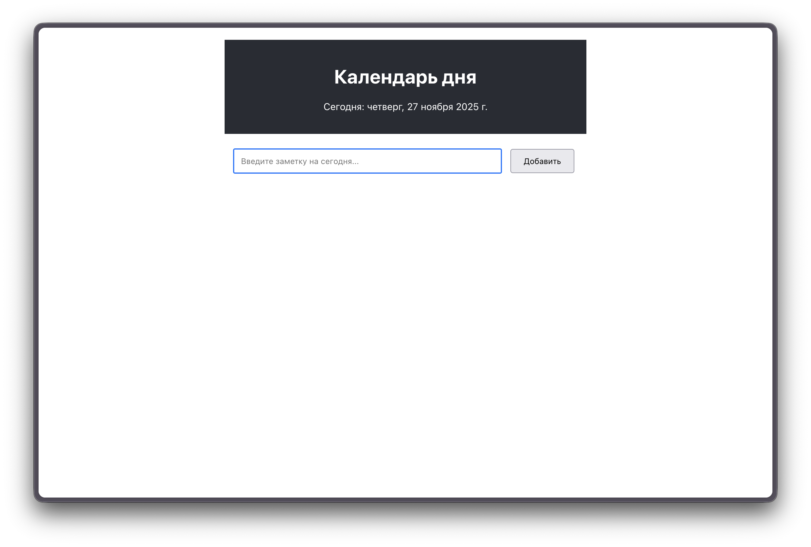
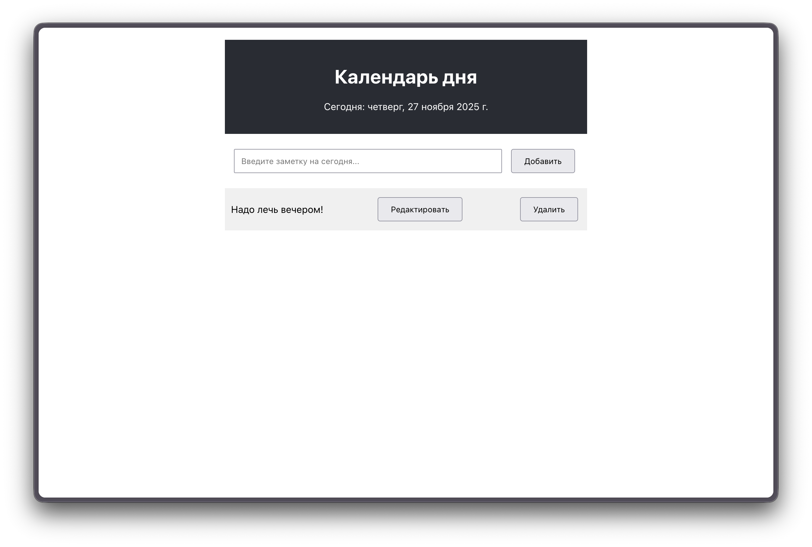
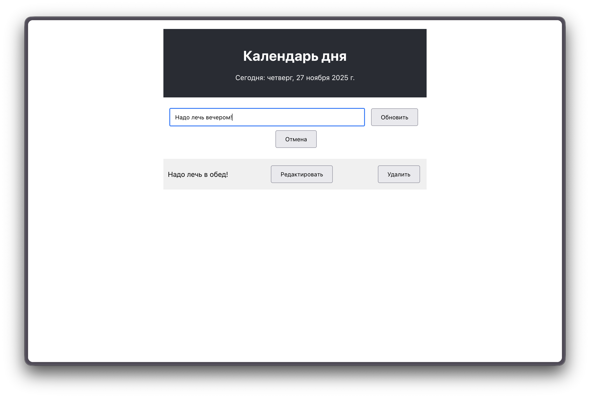
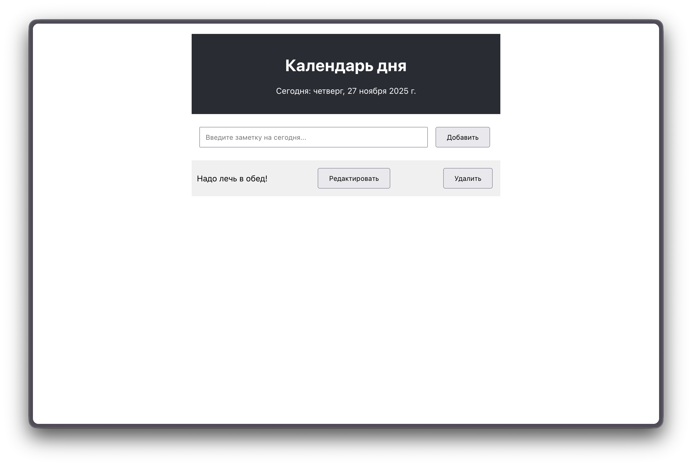

# Календарь дня — React-приложение для заметок

Это небольшое React-приложение, позволяющее создавать, редактировать и удалять заметки, привязанные к текущему дню. Все заметки автоматически сохраняются в **localStorage**, поэтому они остаются даже после перезагрузки страницы.

## Функционал

* Отображение текущей даты в формате «день недели, число месяц год»
* Добавление новой заметки
* Редактирование существующей заметки
* Удаление заметок
* Автоматическое сохранение всех данных в **localStorage**
* Простая и понятная структура компонентов

## Используемые технологии

* **React** (функциональные компоненты)
* **React Hooks** (*useState*, *useEffect*)
* **LocalStorage** для хранения данных
* **CSS** для базового оформления


## Скриншоты работоспособности

### Главный экран


### Добавление заметки


### Редактирование заметки


### Изменение заметки


## Как запустить проект

```bash
npm install
npm start
```

Приложение откроется по адресу:

```
http://localhost:3000
```

## Сборка проекта

```bash
npm run build
```

Готовая сборка будет находиться в папке **/build**.

## Описание работы

В приложении реализована базовая архитектура: каждый компонент отвечает за свою отдельную часть.
Основная логика заметок расположена в **App.js**, где находятся функции:

* **addOrUpdateNote()** — добавление и обновление заметки
* **deleteNote()** — удаление заметки
* **editNote()** — выбор заметки для редактирования

Список заметок отображается компонентом **NoteList**, а ввод текста осуществляется через компонент **NoteForm**.
Компонент **DateDisplay** выводит текущую дату в удобном формате.
